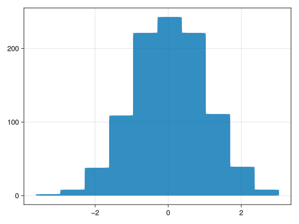
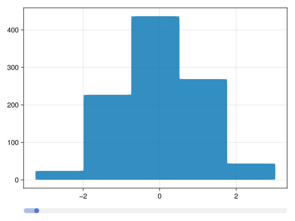
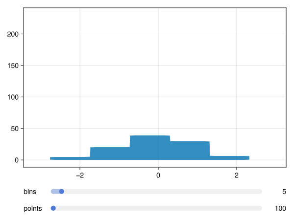

# Interactive Histogram

## Purpose

Build an interactive histogram from a static one.

## Static Histogram

``` julia
f = Figure()
o_data = randn(1000);
o_bins = 10;
hist!(Axis(f[1,1]), o_data, bins = o_bins) 
```



Saving the histogram is done by

``` julia
julia> save("hist1.png", f)
```

## Dynamic bins

The slider has it's value as an observable as the `value` slot.
Note that the call to `hist!` is un-changed.

``` julia
f = Figure()
sl1 = Makie.Slider(f[2,1], range = 1:100, startvalue = 5)
o_bins = sl1.value
o_data = randn(1000);
hist!(Axis(f[1,1]), o_data, bins = o_bins) 
```



Generating the animation is done using the `record` function and forcing the slider using `set_close_to`:

``` julia
force = [5:95; 95:-1:5]
record(f, "hist2.gif", force; framerate = 20) do b
  set_close_to!(sl1, b) 
end
```

## Annotated sliders

If we use `SliderGrid`, we get multiple sliders, and annotation of name and value:

``` julia
f = Figure()
sg = SliderGrid(f[2,1],
                (label = "bins", range = 1:100, startvalue=5),
                (label = "points", range = 100:1:1000, startvalue=500),
                )
o_bins = sg.sliders[1].value
o_data = @lift randn($(sg.sliders[2].value))
hist!(Axis(f[1,1]), o_data, bins = o_bins) 
```



Note, the call to `hist!()` is still the same.

We can animate both using `zip`

``` julia
force1 = [5:95; 95:-1:5]
force2 = [100:10:1000; 1000:-10:100]
force = zip(force1, force2)
record(f, "hist3.gif", force; framerate = 20) do b
  set_close_to!(sg.sliders[1], b[1]) 
  set_close_to!(sg.sliders[2], b[2]) 
end
```
