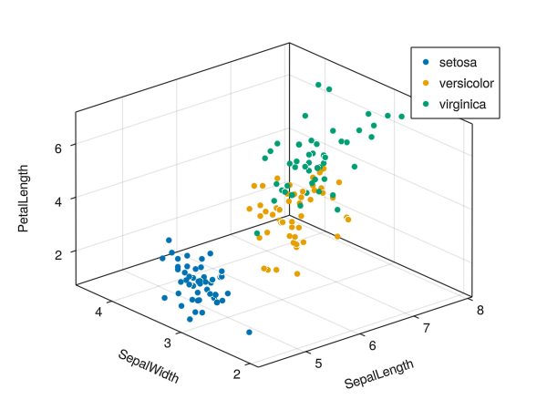

# Plot 3D

3D plot with color variable.

``` julia
using GLMakie
using DataFrames
using RDatasets
using CategoricalArrays


iris = dataset("datasets", "iris")


function plot3d(df; x_var=:x , y_var=:y, z_var=:z, color_var=:color)
    x_dat = df[:,x_var]
    y_dat = df[:,y_var]
    z_dat = df[:,z_var]
    color_dat = df[:,color_var]
    color_levels = unique(color_dat)
    fig = Figure()
    ax = Axis3(fig[1,1], xlabel = string(x_var), ylabel = string(y_var), zlabel=string(z_var))
    for c in color_levels
        scatter!(ax, x_dat[color_dat .== c], y_dat[color_dat .== c], z_dat[color_dat .== c], label = c)
    end
    axislegend()
    (;fig,ax)
end

fig, ax = plot3d(iris, x_var = :SepalLength, y_var = :SepalWidth, z_var = :PetalLength, color_var = :Species)

fig

```



Saving plot:

``` julia
save("plot3d.png", fig)
```

