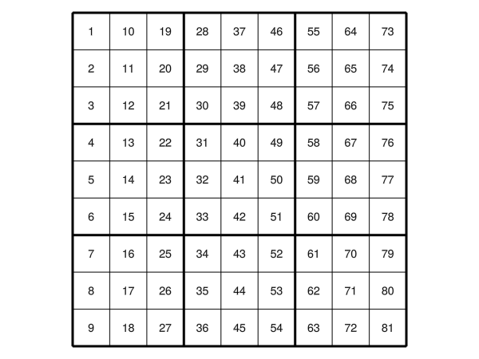

# Sudoku

A sodoku grid made with major and minor grid-lines.

``` julia
function mk_axis(ax)
Axis(ax,     aspect = DataAspect(),
     xgridcolor = :black,
     ygridcolor = :black,
     xgridwidth = 3,
     ygridwidth = 3,
     xminorgridcolor = :black,
     yminorgridcolor = :black,
     xminorgridvisible = true,
     yminorgridvisible = true,
     xminorticks = IntervalsBetween(3),
     yminorticks = IntervalsBetween(3),
     xticksvisible = false,
     xticklabelsize = 0.0, 
     yticklabelsize = 0.0, 
     yticksvisible = false,
     )
end

function plot_mat!(ax,mat)
  i, j = size(mat)
  text!(ax,
        vec(Point2f.(Tuple.(CartesianIndices(mat)))) .- repeat([[0.5, 0.5]], i*j ),
        text = vec(string.(rotr90(mat))), 
        align = (:center,:center),
        )
  xlims!(0,i)
  ylims!(0,j)
end

mat = reshape(collect(1:81), 9,9)
f = Figure()
ax1 = mk_axis(f[1,1])
plot_mat!(ax1,mat)
f

```



